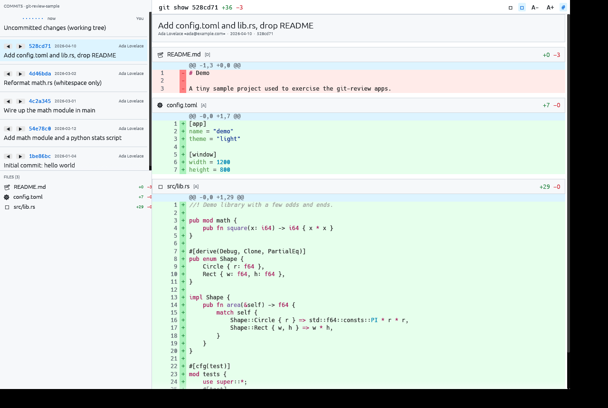

# git-review — egui

The [`git-review`](../SPEC.md) code-review app implemented with
[egui](https://github.com/emilk/egui) 0.34 (immediate mode) via `eframe`.



## Run

```sh
cargo run --release -- /path/to/repo      # defaults to the current directory
```

## Layout of the code

- `src/git.rs` — framework-agnostic git/diff model built on `git2` (the same module is mirrored
  in the other native apps).
- `src/highlight.rs` — per-line syntax highlighting with `syntect` + `two-face`.
- `src/app.rs` — the egui UI: resizable `Panel`s, the toolbar, the commit list, the file tree,
  and the manually-laid-out diff view (full-width tinted rows, a line-number/sign gutter, and a
  sticky per-file header overlay).
- `src/main.rs` — entry point / argument handling.

## egui notes for the comparison

- **Resizable split panels** come for free with `egui::Panel` (`.resizable(true)`); the side
  panel's top/bottom split is a nested `Panel::top` + `CentralPanel`.
- **Immediate mode** means the whole UI is re-emitted every frame. The diff body is drawn by hand
  with `allocate_exact_size` + `Painter` so each row can have a full-width background and precise
  gutter columns — higher control, but more manual than a retained widget tree.
- **Sticky headers** aren't built in: the topmost visible file is found from the scroll offset and
  re-drawn in a foreground `Area`.
- **Scroll-to-file** uses `ui.scroll_to_rect` on the target file's header.
- eframe 0.34 changed the `App` trait so `ui()` (not `update()`) is the required entry point.

## Headless verification

Builds clean (`cargo build`) and starts without panicking under `xvfb-run` against the sample
repo from `tools/make-sample-repo.sh`. Software GL works (`LIBGL_ALWAYS_SOFTWARE=1`).
