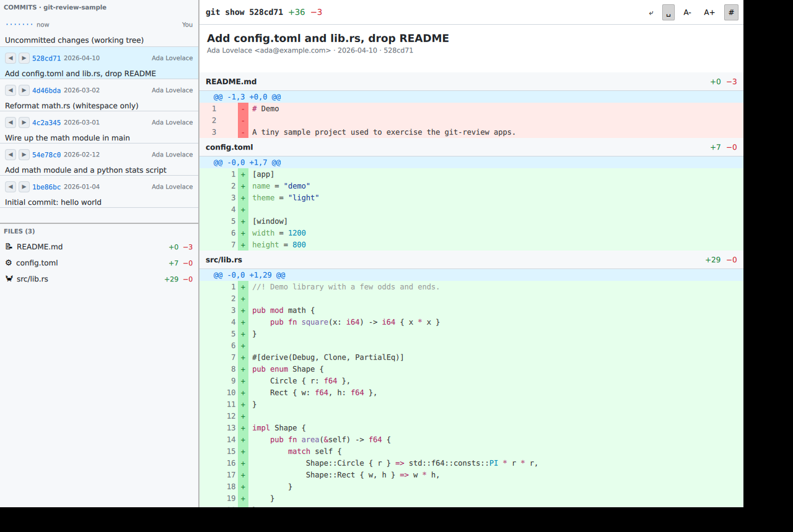

# git-review — qmetaobject-rs (Qt Quick / QML)

The [`git-review`](../SPEC.md) code-review app implemented with
[qmetaobject-rs](https://github.com/woboq/qmetaobject-rs) — a Rust `QObject` backend driving a
**Qt Quick / QML** UI. Needs **Qt 6** (uses `qmake6`; see `.cargo/config.toml`).



## Run

```sh
# Qt6 dev packages required; the build finds Qt via QMAKE=/usr/bin/qmake6 (.cargo/config.toml)
cargo run --release -- /path/to/repo           # defaults to the current directory
```

## Layout of the code

- `qml/main.qml` — the whole UI (embedded via the `qrc!` macro): `SplitView`s, the toolbar,
  the commit/file `ListView`s, and the diff `ListView`.
- `src/main.rs` — the `Backend` `QObject`. It exposes the model as **JSON strings** (parsed in
  QML with `JSON.parse`) plus the toolbar settings as properties, and slots
  (`select_commit`, `set_from/to`, `toggle_*`, `font_inc/dec`). Highlighting is done in Rust
  (syntect → `<span style=color>` RichText).
- `src/git.rs`, `src/highlight.rs` — the shared, framework-agnostic git/diff/highlight model.

## qmetaobject / Qt notes for the comparison

- **Resizable splits:** `QtQuick.Controls`' `SplitView` is built in — an outer horizontal split
  (side | main) with a nested vertical split (commits | files). The most "batteries-included"
  splitter of any framework here.
- **True sticky headers for free:** the diff `ListView` uses `section.property: "file"`; QML
  list sections are pinned by default, so each file's header sticks while its rows scroll — no
  manual offset math (unlike the immediate-mode/Elm apps).
- **Data flow:** rather than custom `QAbstractListModel`s, the Rust side emits compact JSON and
  QML `JSON.parse`s it into array models — minimal glue, and the `updated()` signal re-evaluates
  every binding.
- **Highlighting:** syntect spans become Qt `Text { textFormat: RichText }` HTML; spaces are
  `&nbsp;`-escaped so code indentation survives RichText whitespace collapsing.
- `scroll-to-file` uses `ListView.positionViewAtIndex`; `ToolTip` gives the toolbar buttons their
  hover tooltips.

## Headless verification

Builds against Qt 6.4 and runs under `xvfb` (`QT_QPA_PLATFORM` defaults to xcb; software GL).
See `screenshot.png`, captured against the sample repo.
