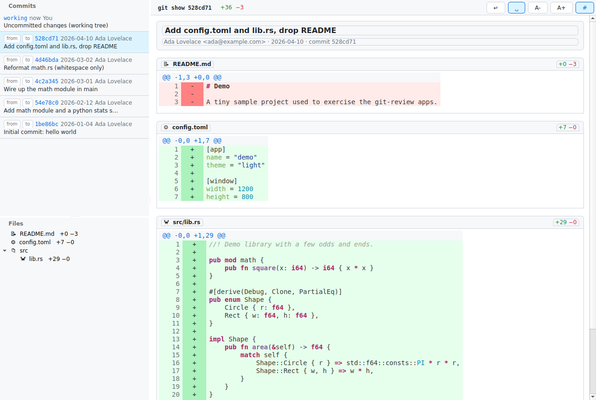

# git-review — Qt Widgets edition

A GitHub-style git code-review desktop app, implemented with **genuine Qt Widgets** (not QML),
driven from Rust. Part of the multi-framework comparison in this repo.



## Which binding, and why

The task suggested the **ritual `rust-qt`** crates (`qt_widgets`, `qt_gui`, `qt_core`). Those crates
target **Qt 5** and use a pre-generated FFI layer; this environment ships **only Qt 6** (6.4.2,
`qt6-base-dev`) and `apt` has no `qtbase5-dev` candidate here. Rather than fight a mismatched
binding, this app uses the second sanctioned path:

> **A small C++ Qt Widgets shim compiled with the `cc` crate, driven from Rust over a C ABI.**

- `src/shim.cpp` builds the entire UI with real Qt Widgets: `QMainWindow`, nested `QSplitter`s,
  `QListWidget`, `QTreeWidget`, `QToolBar` + `QToolButton`, `QScrollArea`, `QTextEdit`, `QLabel`.
- `build.rs` discovers Qt 6 via `pkg-config --cflags/--libs Qt6Widgets` and compiles the shim with
  `cc`, then links `Qt6Widgets/Gui/Core` + `stdc++`.
- No `moc` pass is needed: all signal/slot wiring uses Qt's **functor-based `connect()`** with C++
  lambdas, so there are no `Q_OBJECT` macros and no generated meta-object code to build.
- The Rust side (`src/git.rs`, `src/highlight.rs` — copied verbatim from the shared `egui` model)
  does all git2/syntect work and hands the UI ready-to-render **JSON** through `src/ffi.rs`
  (`gr_commits`, `gr_show`, `gr_range`, `gr_working`, ...). The C++ side parses it with
  `QJsonDocument` and builds widgets.

This is a real QtWidgets app and is therefore distinct from the two QML-based Qt apps in the repo
(`qt-cxx` via cxx-qt, `qt-qmetaobject` via qmetaobject-rs).

## Build & run

```sh
cd qt-widgets
cargo build
./target/debug/git-review-qtwidgets /tmp/git-review-sample
```

Repository path resolution: **argv[1]** -> `$GIT_REVIEW_REPO` -> current directory.

Requires `qt6-base-dev` + `pkg-config` (already present in this environment). Generate a demo repo
with `../tools/make-sample-repo.sh`.

### Headless smoke test (how the screenshot was made)

```sh
Xvfb :89 -screen 0 1280x860x24 &
DISPLAY=:89 QT_QPA_PLATFORM=xcb LIBGL_ALWAYS_SOFTWARE=1 \
  ./target/debug/git-review-qtwidgets /tmp/git-review-sample &
DISPLAY=:89 import -window root screenshot.png
```

## Features (per SPEC.md)

- **Resizable left side panel** via an outer horizontal `QSplitter`; the panel itself is an inner
  vertical `QSplitter` splitting the **commit list** (top) from the **file tree** (bottom).
- **Toolbar**: left-aligned summary (`git show <sha>` / `git diff <from> <to>`) + green/red `+a −r`
  counts; right-aligned 5 tool buttons with tooltips — word wrap, show space changes, `A-`, `A+`,
  line numbers. Toggles are checkable and look pressed when active.
- **Commit list**: synthetic working-tree row first, then `HEAD` history. Each row is two lines —
  `[from] [to]` endpoint buttons + short sha + date + author, then the title. Clicking a row opens
  that commit (`git show`); the current row is highlighted. The endpoint buttons set the two ends of
  a `git diff from..to` comparison.
- **File tree**: per-directory grouping, file-type icon by extension, name, and `+added −removed`
  counts. Clicking a file scrolls the diff view to that file's section
  (`QScrollArea::ensureWidgetVisible`).
- **Diff view**: optional commit-message block for a single commit; per-file header (path + counts);
  a `+`/`-`/` ` change-marker column; an old/new line-number gutter (toggleable); **syntect** syntax
  highlighting via per-span HTML colors; green/red line backgrounds with stronger green/red marker
  cells. Honors word-wrap, line-numbers, font-size, and ignore-whitespace settings live.

## How Qt Widgets compares to the QML Qt apps

- **Imperative, not declarative.** The UI is built and mutated in C++ procedurally
  (`new QSplitter`, `addWidget`, `connect(...)`), versus QML's declarative scene graph + property
  bindings in `qt-cxx` / `qt-qmetaobject`. There is no QML engine, no JS, no property-binding
  reactivity — state changes call explicit rebuild functions (`reloadDiff` -> `renderDiff`).
- **Native desktop widgets.** `QSplitter`, `QTreeWidget`, `QListWidget`, `QToolBar` give
  platform-native splitter handles, item views, and theming "for free"; the QML apps re-create such
  chrome from Quick Controls.
- **Lighter runtime, heavier glue.** No QML/Quick/Qt-Declarative dependency at runtime, but the
  Rust<->C++ boundary is hand-written (JSON over a C ABI) rather than the auto-generated
  `QObject`/`Q_PROPERTY` bridges that cxx-qt and qmetaobject-rs provide. That keeps the build simple
  (just `cc` + `pkg-config`, no `moc`) at the cost of a manual serialization layer.
