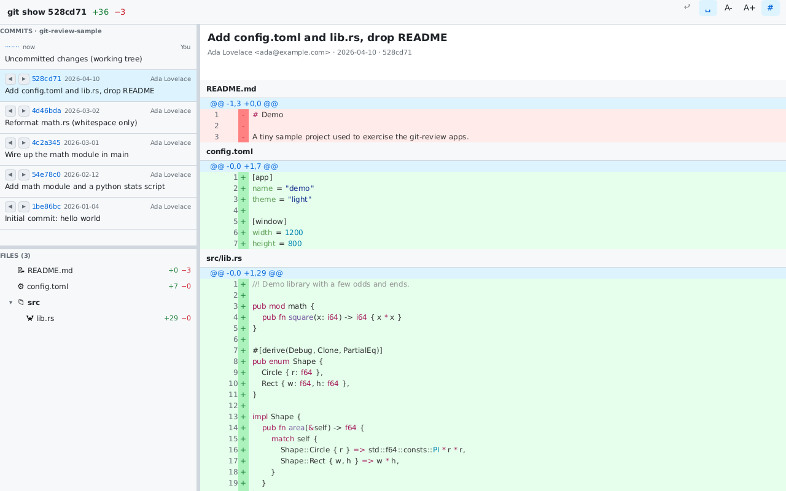

# git-review — Slint

The [`git-review`](../SPEC.md) code-review app implemented with [Slint](https://slint.dev) 1.16
(declarative `.slint` markup + a Rust backend).



## Run

```sh
cargo run --release -- /path/to/repo          # defaults to the current directory
# headless: SLINT_BACKEND=winit-software cargo run -- /path/to/repo
```

## Layout of the code

- `ui/app.slint` — the entire UI: the `Theme` global (both GitHub light + dark palettes), data
  `struct`s mirrored in Rust (`CommitRow`, `TreeNode`, `DiffItem`, `Span`), reusable
  `ToolButton`/`EndpointButton` components, and the window: a root `VerticalLayout` of a
  full-width toolbar over a `HorizontalLayout` of side-panel | handle | diff `Flickable`.
- `build.rs` — compiles `app.slint` via `slint-build`.
- `src/git.rs`, `src/highlight.rs` — the framework-agnostic git/diff/highlight model (shared,
  verbatim, with the other native apps).
- `src/main.rs` — opens the repo, builds the Slint models, and wires every callback.

## Slint notes for the comparison

- **Resizable splits:** Slint has no built-in splitter widget, so the horizontal (side|main) and
  vertical (commits|files) handles are thin `Rectangle`s with a `TouchArea` whose `moved`
  callback adjusts a `<length>` property (`clamp`ed). A few lines each, fully declarative.
- **Full-width toolbar:** the root is a `VerticalLayout` whose first child is the toolbar bar
  (distinct panel background + a 1px bottom border), spanning the whole window above the
  side-panel/diff split.
- **Theme:** Slint exposes the OS scheme via StdWidgets `Palette.color-scheme`; the `Theme` global
  defines both GitHub palettes and picks per-property on `color-scheme == ColorScheme.dark`
  (headless defaults to light). `highlight.rs` switches syntect themes (`InspiredGitHub` /
  `base16-ocean.dark`) to match.
- **Models:** the commit list, file tree and diff body are `[struct]` properties fed from Rust
  via `ModelRc<VecModel<…>>`; `for x in model:` repeats the rows.
- **Hierarchical file tree:** Slint models are flat, so the tree is built in Rust as a flattened
  `[TreeNode]` (depth, is-dir, expanded, name, icon, +added/−removed, file-index), indented by
  `depth`, with single-child dir chains collapsed GitHub-style. Expand/collapse flips `expanded`,
  recomputes visibility, and re-pushes the model (only visible rows are emitted).
- **Syntax highlighting:** Slint `Text` has no rich-text runs, so each highlighted line is a
  `HorizontalLayout` of one coloured `Text` per syntect span.
- **Sticky header + scroll-to:** the diff is a `Flickable`; Rust precomputes each file's y-offset
  (rows have an explicit `row-h`, kept in sync with the layout) and a `changed viewport-y`
  handler reports the offset so Rust can update the floating sticky-header properties.
  `scroll-to` is a `public function` that sets `viewport-y`.

## Headless verification

Builds clean (`cargo build`) and renders correctly under `xvfb` with the software backend
(`SLINT_BACKEND=winit-software`); see `screenshot.png`, captured against the sample repo.
