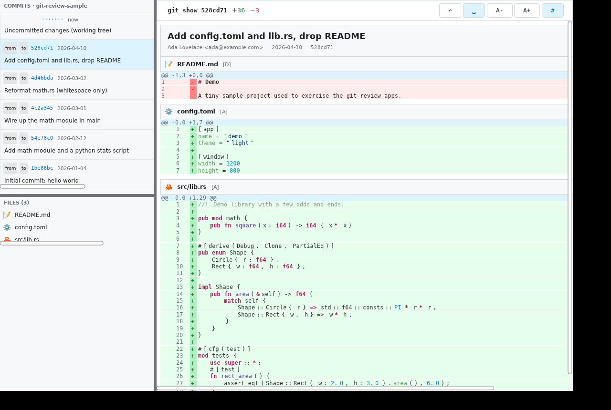

# git-review · Xilem

A GitHub-style **code review** desktop app, implemented with
[Xilem](https://github.com/linebender/xilem) — Linebender's experimental reactive Rust UI
toolkit (Masonry widgets + Parley text + Vello/wgpu GPU rendering).

This is one implementation of the shared [`../SPEC.md`](../SPEC.md); the data layer
(`src/git.rs`, `src/highlight.rs`) is copied verbatim from the other apps so the comparison is
apples-to-apples.



## Running

```sh
cargo run --release -- /path/to/a/git/repo
# or
cargo run -- /path/to/a/git/repo
```

The repository to review is taken from `argv[1]`, then `$GIT_REVIEW_REPO`, then the current
directory. A demo repo can be generated with `../tools/make-sample-repo.sh`.

Xilem renders through **Vello on wgpu**, so it needs a working GPU adapter (Vulkan / Metal /
DX12). On a normal desktop it just works. For a headless box see the next section.

### Headless / software rendering

The app runs fine under `Xvfb` if a software Vulkan implementation (Mesa **lavapipe**) is
present. The screenshot above was produced this way:

```sh
export DISPLAY=:88 LIBGL_ALWAYS_SOFTWARE=1
export VK_ICD_FILENAMES=/usr/share/vulkan/icd.d/lvp_icd.json   # force lavapipe (software Vulkan)
export XDG_RUNTIME_DIR=/tmp/xdg; mkdir -p $XDG_RUNTIME_DIR; chmod 700 $XDG_RUNTIME_DIR

Xvfb :88 -screen 0 1280x860x24 &
./target/debug/git-review-xilem /tmp/git-review-sample &
sleep 9
import -window root screenshot.png        # ImageMagick
```

Without a Vulkan ICD, wgpu fails to acquire an adapter and the window never appears — that is a
*runtime* requirement of Vello/wgpu, not a problem with this code. (`LIBGL_ALWAYS_SOFTWARE` only
affects GL; the meaningful switch here is the lavapipe Vulkan ICD.)

## How Xilem maps onto the spec

Xilem is an Elm-/SwiftUI-style **declarative** toolkit: `app_logic(&mut App) -> impl WidgetView`
rebuilds a view tree every update, and Xilem diffs it against the live Masonry widget tree.
Event handlers get `&mut App` and mutate state directly; there are no signals or manual
invalidation.

What worked cleanly:

- **Resizable side panel + split** — Masonry ships a real `split` widget with a *draggable*
  bar (`draggable` defaults to `true`). The layout is a horizontal split (side panel vs. main
  view) whose left child is itself a vertical split (commit list over file tree), giving all
  three real, drag-resizable boundaries the spec asks for. `solid_bar(true)` draws a visible
  divider.
- **Toolbar** — a `flex_row` with the `git show <sha>  +added −removed` summary on the left
  (monospace, with green/red counts) and the five icon `button`s on the right; an active toggle
  is shown "pressed" by swapping its background/foreground colour.
- **Commit list / file tree** — built from `flex_col`s of per-row `flex_row`s inside a `portal`
  (Masonry's scroll container). Two-line commit rows, `[from]`/`[to]` endpoint buttons, the
  synthetic "Uncommitted changes" row, selection highlight, and per-file `+/−` counts with
  extension icons all map directly.
- **Diff body** — single-commit message block, then per-file header + unified diff. The gutter
  (old/new line numbers + `+`/`-`/` ` marker), green/red row backgrounds, stronger
  green/red marker strip, and **syntect** syntax colours all render as designed.
- **Live settings** — word-wrap, ignore-whitespace (re-runs the diff), font size, and
  line-numbers toggles all mutate `App` and the view rebuilds.

## Alpha limitations & compromises

Xilem on crates.io is **0.4** (alpha) and Masonry's view-layer API is still small and unstable.
Everything below was verified against the installed sources, not guessed:

1. **Multi-colour text per line.** Masonry's `Label` is *single-style* — one colour/weight for
   the whole label, no rich text runs at the view layer. Syntax highlighting is therefore
   approximated by laying out **one `Label` per syntect span** in a `flex_row`. This reproduces
   the colours faithfully (see the screenshot) at the cost of more widgets per line. With
   **word-wrap on**, the spans are instead joined into a single `prose` block so the line can
   wrap — which loses per-span colour for that line (the only place rich-text runs would be
   needed).

2. **Sticky file headers.** A `Portal` has no "pinned sub-region" API, so file headers scroll
   with the content instead of sticking to the top of the viewport. They're styled as a distinct
   bar so they still read as clear section dividers.

3. **Click-to-scroll file tree.** The view-layer `Portal` exposes no programmatic
   *scroll-to-child* API in 0.4, so clicking a file in the tree cannot scroll the diff to that
   file's section. File rows therefore display icon / path / counts but are non-interactive. (The
   commit list and endpoint buttons are fully interactive.)

4. **State must be `Send + Sync`.** Xilem requires the app state to be `Send + Sync` (views carry
   `PhantomData<State>` and must themselves be `Send + Sync`). `git2::Repository` is `Send` but
   **not** `Sync`, so `App` wraps the `Repo` in a `std::sync::Mutex<Repo>` — this makes `App`
   `Sync` without touching the shared `git.rs`. (egui, by contrast, imposes no such bound and
   holds the `Repo` directly.)

5. **Method ordering on the builder API.** Masonry's styling lives in a `Style` trait whose
   methods return a `Prop<…>` wrapper, while widget-specific builders (`Label::text_size/weight`,
   `SizedBox::expand/width`) are inherent methods that only exist on the concrete type. So
   inherent calls must precede `Style` calls in a chain (`label(..).text_size(..).color(..)`,
   `sized_box(..).expand_width().background_color(..)`); the reverse fails to compile. Not a
   limitation so much as a sharp edge of the current API.

6. **Flexible spacers in type-erased lists.** A `FlexSpacer::Flex` carries flex weighting that
   can't be expressed through a boxed `AnyWidgetView`, so in dynamically-built row lists a
   flexible gap is approximated with an `expand_width` transparent box (`flex_spacer()`).

Despite the above, the layout, toolbar, commit/file panels, scrollable syntax-highlighted diff
with the full gutter and red/green backgrounds, and all four live settings are implemented and
working.
